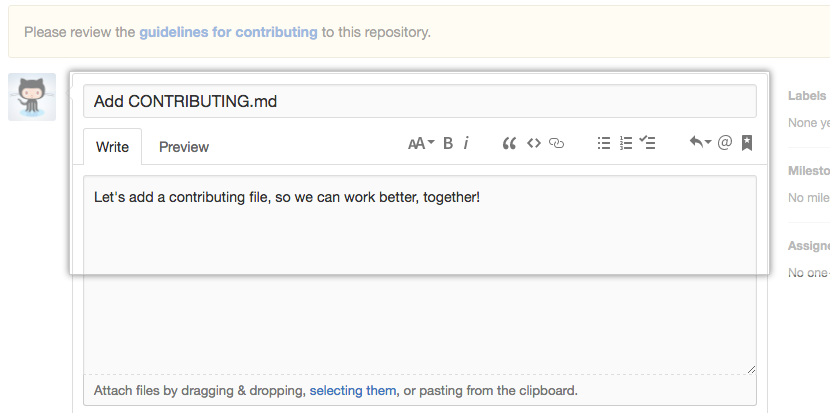

# Contributing Guidelines  
  
This documentation contains a set of guidelines to help you during the contribution process.   
We are happy to welcome all the contributions from anyone willing to improve/add new scripts to this project. Thank you for helping out and remember, No contribution is too small.
  
# Submitting Contributions👩‍💻👨‍💻  
Below you will find the process and workflow used to review and merge your changes.  
## Step 0 : Identify what you want to contribute.
- If you want to add or change a major feature, create an issue and discuss with the maintainer what you would like to change.
- If you want to work on an Existing Issues or an Issue that you created, check if anyone is working on that issue.
- If no one is working on the issue, just comment and start working on it otherwise wait for the Issue to be assigned to you.


## Step 1 : Fork the Project  
- Fork this Repository. This will create a Local Copy of this Repository on your Github Profile. Keep a reference to the original project in `upstream` remote.  
```  
$ git clone https://github.com/<your-username>/<repo-name>  
$ cd ToDoista
$ git remote add upstream https://github.com/garimasingh128/ToDoista.git
```  


- If you have already forked the project, update your copy before working.  
```  
$ git remote update  
$ git checkout <branch-name>  
$ git rebase upstream/<branch-name>  
```  
## Step 2 : Branch 
**Make a branch only if you are working on a major feature otherwise skip this step.**
Create a new branch. Use its name to identify the issue your addressing.  
```  
# It will create a new branch with name Branch_Name and switch to that branch 
$ git checkout -b branch_name  
```  

Our branching strategy is based on [this article](https://nvie.com/posts/a-successful-git-branching-model/) which I suggest you read.

+  **master** a history of releases, once merged to from develop and tagged we create a release on the play store & GitHub releases.

+  **develop**  the actively worked on next release of the app, what we branch off of while working on new features and what we merge into upon feature completion

+ **feature/** or feature/\<username\>/ any branch under this directory is an actively developed feature, feature branches culminate in a PR, are merged and deleted.
 Typically a feature branch is off of develop and into develop but in rare scenarios if there is an issue in production a branch may be made off master to fix this issue, this type of feature branch must be merged to develop and master before being deleted.
Branch names should be in the format **\<issue-number\>-kebab-case-title**

All branches should have distinct history and should be visually easy to follow, for this reason only perform merge commits when merging code either by PR or when synchronising.

If you wish to rebase you should be following the [Golden Rule](https://www.atlassian.com/git/tutorials/merging-vs-rebasing#the-golden-rule-of-rebasing) and ahere to the advice in the heading [Aside: Rebase as cleanup is awesome in the coding lifecycle](https://www.atlassian.com/git/articles/git-team-workflows-merge-or-rebase).

## Step 3 : Work Remotely  
- Now you are ready to your work to the remote repository.

## Step 4 : Work on the feature/ issue.  
- Add all the files/folders needed.  
- After you've made changes or made your contribution to the project add changes to the branch you've just created by:  
```  
# To add all new files to branch Branch_Name  
$ git add .  

# To add only a few files to Branch_Name
$ git add <some files>
```

## Step 5 : Commit  
- To commit give a descriptive message for the convenience of reviewer by:  
```
# This message get associated with all files you have changed  
$ git commit -m "message"  
```  

## Step 6 : Upload your changes   
- When your work is ready and complies with the project conventions, upload your changes to your fork:  
  
```  
# To push your work to your remote repository  
$ git push -u origin Branch_Name  
```  
- Here is how your branch will look in the fork.


## Step 7 : Pull Request  
- Go to your repository in browser and click on compare and pull requests. Then add a title and description to your pull request that explains your contribution.  
  
  

- Voila! Your Pull Request has been submitted and will be reviewed by the moderators and merged.🥳  

## Linting

PR should be linted properly locally. There is no system restriction applied for this, however, PRs will not be merged until they contain properly formatted code.

## Continous Integration

All PRs will have all these tests run and a combined coverage report will be attached, if coverage is to go down the PR will be marked failed. On Travis CI the automated tests are run on an emulator.

## Need more help?🤔  
You can refer to the following articles on basics of Git and Github and also contact the Project Mentors, in case you are stuck:  
- [Forking a Repo](https://help.github.com/en/github/getting-started-with-github/fork-a-repo)  
- [Cloning a Repo](https://help.github.com/en/desktop/contributing-to-projects/creating-an-issue-or-pull-request)  
- [How to create a Pull Request](https://opensource.com/article/19/7/create-pull-request-github)  
- [Getting started with Git and GitHub](https://towardsdatascience.com/getting-started-with-git-and-github-6fcd0f2d4ac6)  
- [Learn GitHub from Scratch](https://lab.github.com/githubtraining/introduction-to-github)  
  
  
## Things to remember while contributing:
* Please make sure to update tests case wherever necessary.
* If any package is used that was not present in the requirements.txt, add the package name and the version used to the requirements.txt file.