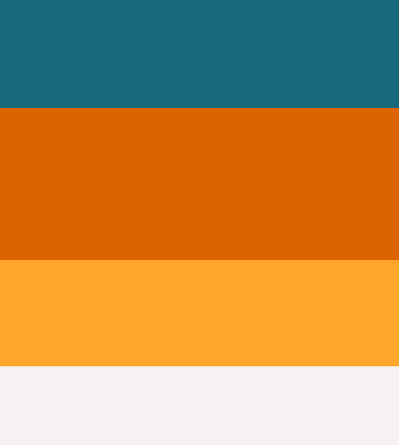
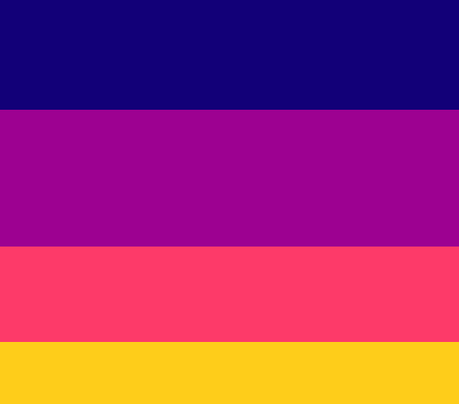
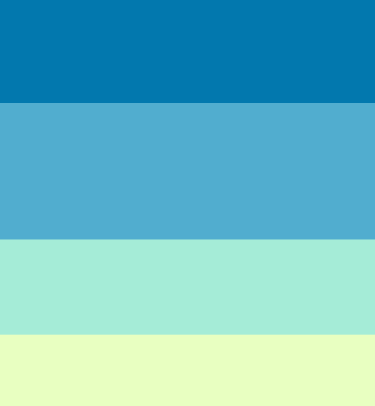
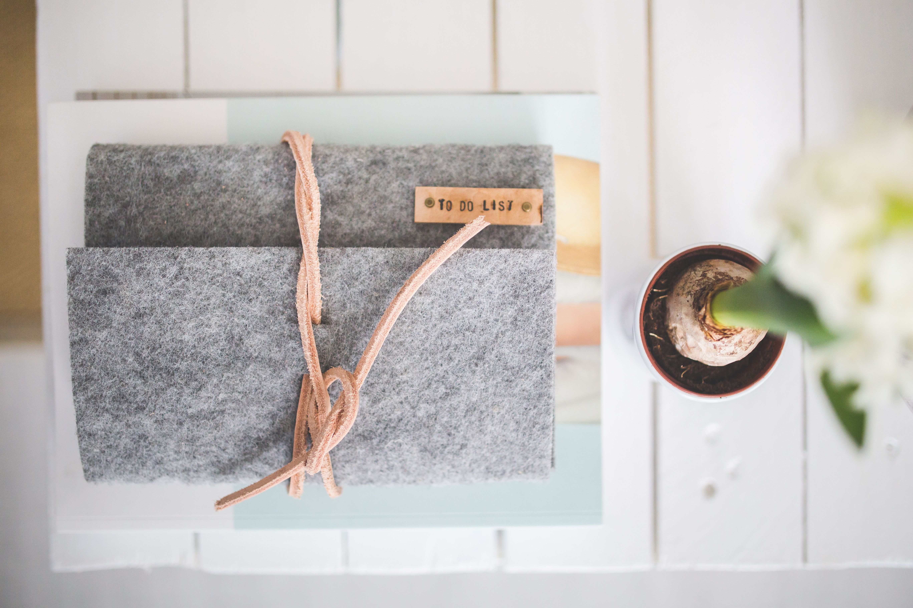
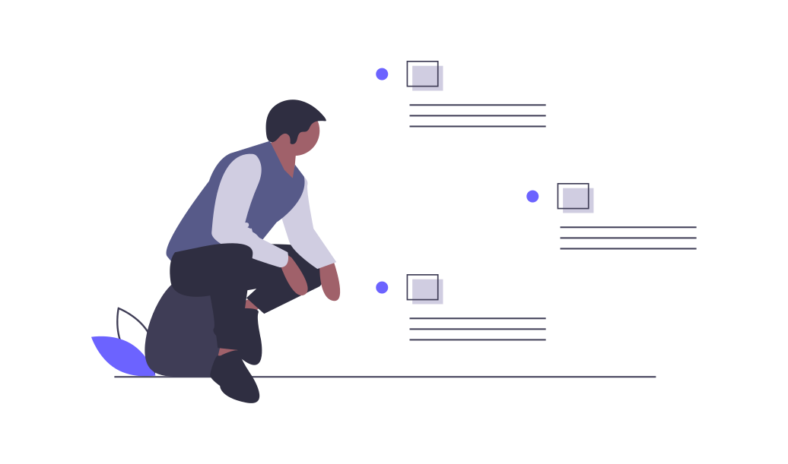

## Project name ideas- 
1. Todoist
1. TickTick
1. DailyPlanner
1. AnyDo
1. Memorigi
1. MyTasks
1. TaskMaster

## Font Families that we can use-
1. Sansita Swashed
CSS-> font-family: 'Sansita Swashed', cursive;
1. Libre Franklin
CSS-> font-family: 'Libre Franklin', sans-serif;
1. Poppins
1. Cinzel
1. Pacifico
1. Yellowtail

## Color Combinations for the app-
These are the trendiest and the classiest color combinations that will help take the project to the next level. Here I have included the Hex codes of the colors.
1. Color Palette 1= 16697a ; db6400 ; ffa62b ;f8f1f1

1. Color Palette 2= 120078 ; 9d0191 ; fd3a69 ; fecd1a

1. Color Palette 3= 0278ae ; 51adcf ; a5ecd7 ; e8ffc1

## Wallpapers
1. Wallpaper1

1. Wallpaper2 color code- #6C63FF

1. Wallpaper3 color code- #6C63FF
